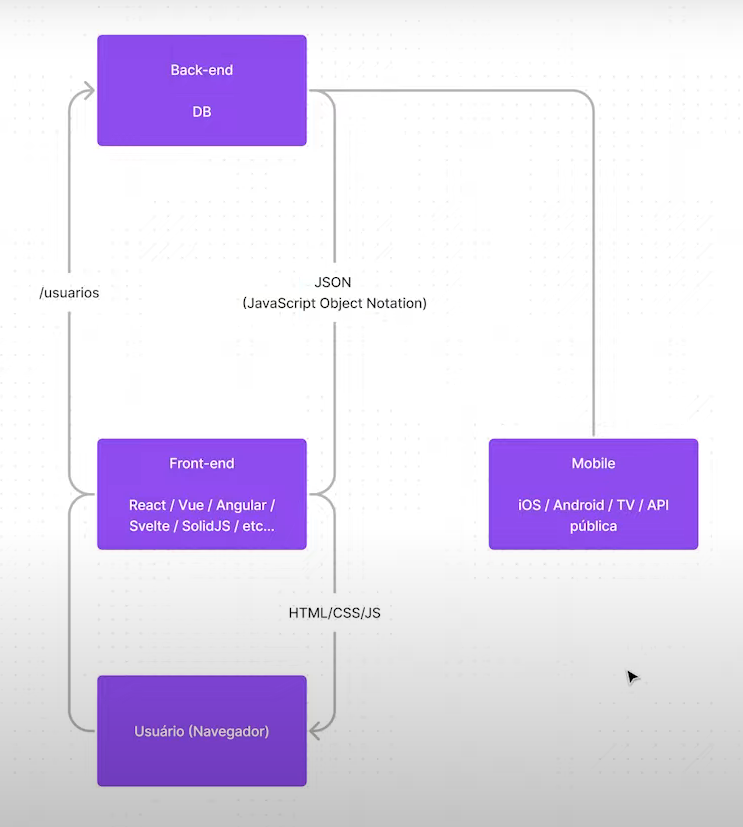

# Anotações Ignite

## API Restful + SPA

Diferente do nosso modelo tradicional onde o **usuário** se comunica com o **Back-end** e este lhe devolve uma cópia do HTML, CSS e JS, no modelo SPA o **usuário(browser)** se comunica com o **Front-end com algum framework** que por ver se comunica com o Back-end e este devolve apenas um **JSON**, o front-end é responsável por montar o site com os dados JSON recebidos.
Dessa maneira o nosso Back-end serve tanto para Desenvolvimento Web como para Desenvolvimento Mobile.

## Anotações do Projeto

- Node na versão mais recente suporta módulos.

  - Adicionamos uma propriedade `"Type": "module"` e renomeamos nossa extensão do arquivo para `.mjs`

- `npm install @types/express -D`

- Podemos usar o pacote `ts-node-dev` para atualizar automáticamente nossas mudanças no servidor.
  - `tsnd src/server.ts`

### Passos

1. Inicializar **express** e ouvir a porta.

   - Testar API usando Insonmia ou Postman.

2. Inicializar **TypeScript**.
   - `"module": "CommonJS"`
   - `"rootDir": "./src"`
   - `"outDir": "./build"`

## Iniciando um projeto React Native

Para inicializar o projeto React Native utilize a **expo-CLI** para rodar o comando: `expo init NomeDoProjeto`.

Com o **Expo GO** instalado no celular podemos rodar o comando: `expo start` para rodar nosso projeto no celular (Precisa estar conectado na mesma rede).